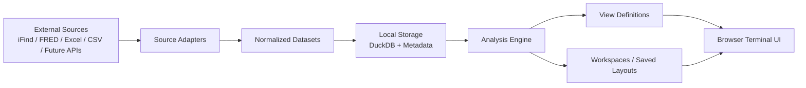

# 金融数据终端下一版架构草图

本文档不是“理想化重写方案”，而是基于当前仓库状态给出的下一版升级蓝图。

目标是把现有工程从“宏观复盘面板”逐步演进为一个可持续扩展的本地优先金融数据终端，支持：

- 接入多种数据源
- 统一清洗、存储、补数、修订回刷
- 用浏览器进行查看、对比、筛选、分析
- 持续新增图表、主题、分析能力
- 不依赖桌面软件形态，Web 即可

---

## 1. 一句话定位

下一版项目建议定位为：

**一个本地优先、浏览器可访问、可扩展的金融数据查看与分析终端。**

它不是单纯的 dashboard，也不是一次性报表系统，而是一个带有以下能力的“终端底座”：

- 数据聚合
- 数据标准化
- 分析变换
- 图表呈现
- 工作区保存
- 模块持续扩展

### 1.1 一个需要提前立住的边界

下一版建议明确一条产品原则：

**Excel 只是补充数据源，不是终端的主工作台。**

它的含义是：

- 可以从 Excel 导入数据
- 可以用 Excel 补手工序列
- 可以把结果导出为 Excel
- 但日常查看、对比、复盘、研究，尽量都在终端内部完成

也就是说，终端里真正的一等公民应该是：

- `dataset`
- `view`
- `workspace`

而不是某个 `.xlsx` 文件。

建议把这条原则进一步拆成五条执行规则：

1. `Excel is ingress, not runtime`
   Excel 是导入入口，不是日常运行界面。

2. `DuckDB is the source of truth`
   一旦导入，系统内标准化数据以 DuckDB 为准，不再以某个 Excel 文件为主。

3. `Research operates on datasets, not files`
   研究和复盘围绕 dataset / view / workspace 进行，而不是围绕文件名进行。

4. `Manual data should be traceable`
   手工补数可以有，但必须记录来源、导入时间、覆盖范围和备注。

5. `Export is optional, not structural`
   导出 Excel 是输出能力，不应该反过来决定系统架构。

---

## 2. 当前工程的优势与瓶颈

### 2.1 当前优势

当前仓库已经具备下一版终端的几个关键基础：

- 有统一的本地存储底座：`data/replay.duckdb`
- 已经有数据源适配能力：`macro_replay/sources/`
- 已经有指标配置体系：`config/indicators.yaml`
- 已经有图表生成与卡片展示链路
- 已经有浏览器查看路径

也就是说，项目不是从零开始，而是已经有了“金融终端内核”的雏形。

### 2.2 当前瓶颈

继续沿着“往现有面板里堆图表和逻辑”的方式前进，会逐步遇到这些问题：

- 数据源扩展越来越依赖 `if/elif` 分支
- 一个指标定义同时承载“数据、分析、图表、页面”多重职责
- 同一份数据难以复用于多种视图
- UI 更偏固定面板，不够像可探索终端
- 主题增多后，维护成本会线性变高

所以下一阶段应该优先做“架构拆分”，而不是“页面继续加按钮”。

---

## 3. 目标架构

建议把系统明确拆成四层：

1. `Source Layer`
   负责接入外部数据源。

2. `Data Layer`
   负责标准化、存储、修订、刷新、元信息管理。

3. `Analysis Layer`
   负责变换、派生序列、组合分析、图表输入整形。

4. `Presentation Layer`
   负责浏览器终端、搜索、对比、工作区、图表交互。

建议关系如下：



这套结构的核心价值是：

- 新增数据源，不必直接改 UI
- 新增图表，不必重写抓数逻辑
- 新增分析能力，不必复制一份数据

补一句更贴近当前项目目标的话：

- Excel 可以继续存在，但被降级为补充输入
- 终端自身才是查看、复盘、研究的主工作台
- 系统以后可以同时支持 CLI / Web / 导出 / Agent，而不被表格文件绑住

---

## 4. 下一版应该引入的核心概念

下一版建议引入五类一等公民对象。

### 4.1 Source

表示一个外部数据入口。

典型例子：

- `ifind_edb`
- `ifind_stock`
- `fred`
- `manual_excel`
- `csv_import`

它负责的事情只有：

- 认证
- 查询
- 拉取
- 原始结果标准化为统一表结构

不负责页面、不负责图表、不负责终端交互。

其中 `manual_excel` 和 `csv_import` 的角色建议明确为：

- 承接系统暂时无法直接抓取的手工数据
- 接收外部研究素材和历史整理文件
- 在迁移阶段吸收既有 Excel 资产

但它们不应该承载：

- 工作区状态
- 图表配置
- 研究备注
- 系统中的最终真相

这些都应该进入终端自己的 registry、workspace 和 metadata。

### 4.2 Dataset

表示一条标准化后的金融时间序列或序列集合。

这是下一版最重要的抽象。

一个 `dataset` 应该具备固定元信息：

- `dataset_id`
- `title`
- `description`
- `asset_class`
- `category`
- `tags`
- `frequency`
- `unit`
- `timezone`
- `source`
- `refresh_policy`
- `revision_policy`
- `availability`

例子：

- `usd.sofr.daily`
- `usd.fed_balance_sheet.weekly`
- `credit.hy_spread.daily`
- `copper.shfe.term_structure`

建议原则：

- 先定义 `dataset`
- 再让图表、页面、分析去消费它

这里尤其要强调：

一个从 Excel 导入的数据，一旦进入系统，就应该先被标准化成 `dataset`，后续所有查看、比较、导出和复盘都围绕这个 `dataset` 进行，而不是继续围绕原始 Excel 文件进行。

也就是说，Excel 更像“收件箱”，`dataset` 才是“研究对象”。

### 4.3 View

表示一个图表或终端视图定义。

同一个 `dataset` 可以有多个 `view`：

- 原始折线图
- 同比图
- 归一化比较图
- spread 图
- 双轴图
- 期限结构图
- 热力图

这层应只描述：

- 用哪些数据
- 用什么变换
- 用什么图表模板
- 如何在终端中展示

### 4.4 Workspace

表示用户保存的一组终端视图。

例如：

- `美元流动性`
- `铜产业链`
- `美国信用风险`
- `我的晨会页`

每个 `workspace` 可以保存：

- 视图布局
- 选中的数据集
- 变换参数
- 时间范围
- 图例状态
- 备注说明

这些工作区状态不应该回写到 Excel 中维护，而应该由终端自身保存。

### 4.5 Job

表示刷新或计算任务。

比如：

- 刷新某个 source
- 刷新某个 dataset
- 重算某个衍生序列
- 重建某个 view 缓存

每个任务都应有状态：

- `queued`
- `running`
- `success`
- `failed`

以及：

- 开始时间
- 结束时间
- 错误信息
- 刷新条数

---

## 5. 推荐目录演进方案

不建议立刻大规模重命名，但建议按下面方向演进。

### 5.1 目标目录

```text
<PROJECT_ROOT>/
  app/
    api/
    services/
    models/
    schemas/
  terminal/
    pages/
    components/
    assets/
  datahub/
    adapters/
    datasets/
    transforms/
    storage/
    jobs/
  config/
    sources/
    datasets/
    views/
    workspaces/
  scripts/
  data/
  charts/
  docs/
  tests/
```

### 5.2 对当前仓库的映射建议

可以按下面的方式逐步迁移，而不是一次性重构。

- `macro_replay/sources/` 逐步演进为 `datahub/adapters/`
- `macro_replay/db.py` 逐步拆到 `datahub/storage/`
- `macro_replay/pipeline.py` 逐步拆成：
  - `datahub/jobs/`
  - `datahub/transforms/`
  - `app/services/`
- `config/indicators.yaml` 逐步拆成：
  - `config/datasets/*.yaml`
  - `config/views/*.yaml`
  - `config/workspaces/*.yaml`
- `macro_replay/streamlit_app.py` 先保留，但把业务逻辑继续抽离到 `app/services/`

建议不要一上来删掉 `macro_replay/`。
更稳妥的做法是：

- 新目录先落地
- 旧模块逐步搬迁
- 页面层继续复用原入口

---

## 6. 数据模型建议

下一版建议明确区分以下几类表。

### 6.1 元信息表

- `sources`
- `datasets`
- `dataset_tags`
- `views`
- `workspaces`
- `jobs`

### 6.2 原始数据表

- `raw_payloads`
- `raw_snapshots`

### 6.3 标准化观测表

- `observations`
- `series_registry`
- `dataset_versions`

### 6.4 衍生结果表

- `derived_observations`
- `view_cache`
- `chart_assets`

### 6.5 推荐关键字段

`series_registry` 建议至少包含：

- `series_id`
- `dataset_id`
- `title`
- `source_id`
- `frequency`
- `unit`
- `currency`
- `timezone`
- `is_revisable`
- `refresh_policy`
- `revision_lookback_days`
- `active`

`observations` 建议长期保留：

- `series_id`
- `obs_time`
- `value`
- `unit`
- `source_id`
- `revision_id`
- `ingested_at`
- `extra`

如果将来你真的想把终端做得更专业，`revision_id` 和 `dataset_versions` 会非常重要，因为金融和宏观数据经常不是“只增不改”。

---

## 7. 配置系统拆分建议

当前 `indicators.yaml` 已经承担了太多事情，建议下一版拆成三类配置。

### 7.1 `sources`

定义数据源接入方式。

例如：

```yaml
id: fred
type: fred
auth: none
rate_limit: low
default_revision_lookback_days: 30
```

### 7.2 `datasets`

定义标准化后的数据集。

例如：

```yaml
id: usd.sofr.daily
title: SOFR
source: fred
frequency: daily
unit: "%"
fetch:
  code: SOFR
storage:
  revision_lookback_days: 30
tags: [usd, rate, liquidity]
```

### 7.3 `views`

定义图表和终端视图。

例如：

```yaml
id: usd.sofr.basic_line
dataset: usd.sofr.daily
transform:
  - type: identity
chart:
  type: line
  y_label: "%"
terminal:
  section: rates
  searchable: true
```

### 7.4 `workspaces`

定义保存好的终端页面。

例如：

```yaml
id: usd_liquidity_workspace
title: 美元流动性
views:
  - usd.sofr.basic_line
  - usd.tga.basic_line
  - usd.rrp.basic_line
layout: grid
```

这样拆完之后，新增内容会更自然：

- 新增数据源：改 `sources`
- 新增数据集：改 `datasets`
- 新增图表：改 `views`
- 新增主题页：改 `workspaces`

---

## 8. 分析能力建议

如果项目目标是“终端”，分析能力不能只靠预先写死的 chart config。

建议把以下能力做成统一变换模块：

- `identity`
- `rebase`
- `pct_change`
- `diff`
- `yoy`
- `mom`
- `rolling_mean`
- `rolling_std`
- `zscore`
- `spread`
- `ratio`
- `resample`
- `align_calendar`

这些变换应同时支持两种模式：

- 配置中预定义
- UI 中临时勾选

建议数据流如下：

```text
dataset -> transform pipeline -> plot-ready frame -> view renderer
```

这样以后你要做“同页对比 + 标准化 + 滚动均值 + 右轴”，不需要每次单独为某个主题写新逻辑。

---

## 9. 浏览器终端应该具备的核心功能

如果目标是终端而不是面板，建议优先建设以下功能。

### 9.1 搜索

支持按以下内容搜索：

- 名称
- 缩写
- 标签
- 来源
- 主题

例如：

- `SOFR`
- `铜库存`
- `10Y-2Y`
- `美元流动性`

### 9.2 对比工作台

允许临时把多个数据集放进同一张图里：

- 统一归一化
- 双轴比较
- 时间范围统一
- 支持临时保存

### 9.3 详情页

每个视图都应该有详情页，至少包含：

- 图表
- 原始数据表
- 元信息
- 来源说明
- 最后更新时间
- 刷新状态
- 是否支持修订

### 9.4 工作区

支持保存常用布局，例如：

- 晨会页
- 宏观页
- 利率页
- 商品页

### 9.5 任务与健康状态

终端上最好有一个地方显示：

- 哪些数据最新
- 哪些图表是旧缓存
- 哪些刷新失败
- 哪些数据源不可用

这个能力在金融终端里很重要，因为“数据状态”本身也是信息。

---

## 10. 后端服务建议

即使短期继续用 Streamlit，也建议把业务能力逐步沉到后端服务层。

建议提供以下服务接口：

- `GET /datasets`
- `GET /datasets/{id}`
- `GET /datasets/{id}/observations`
- `POST /datasets/{id}/refresh`
- `GET /views`
- `GET /views/{id}`
- `GET /workspaces`
- `GET /jobs`
- `POST /jobs/refresh-theme`
- `POST /jobs/refresh-dataset`

这样做的意义是：

- 前端可替换
- 逻辑不被 UI 框架绑死
- 后面想从 Streamlit 迁到更强的前端时成本更低

---

## 11. 前端路线建议

### 11.1 短期

继续使用 Streamlit 作为可用终端壳层。

原因：

- 开发快
- 迭代快
- 当前工程已经接上

但要控制职责：

- Streamlit 负责展示和交互
- 不再承载太多业务逻辑

### 11.2 中期

当以下能力开始变重时，考虑迁移到更可控的 Web 前端：

- 全局搜索
- 工作区拖拽布局
- 更复杂的交互图联动
- 快捷键和命令面板
- 多页签、多视图区管理

也就是说，建议把前端迁移作为“终端能力足够多以后”的阶段性动作，而不是现在立刻重写。

---

## 12. 与当前代码的最小迁移路线

建议按四个阶段推进。

### 阶段 A：稳住当前底座

目标：

- 修复增量更新、修订值回补、读库稳定性
- 把现有页面和服务层职责理顺

当前已经开始做的事情就属于这一步。

### 阶段 B：抽出数据平台内核

目标：

- 引入 `dataset` / `view` / `workspace` 概念
- 把 `indicator` 配置逐步拆解
- 把数据源适配器标准化

建议先做到：

- 不改 UI 也能跑
- 新老配置可并存

### 阶段 C：终端化交互

目标：

- 搜索
- 多序列对比
- 动态变换
- 工作区保存

这一步完成后，产品形态就会明显从“复盘面板”转向“金融终端”。

### 阶段 D：前端升级

目标：

- 如有必要，再把 UI 从 Streamlit 迁到更强的 Web 前端

这一步不是必须先做，而是等功能复杂度真的到了再做。

---

## 13. 建议优先落地的 6 件事

如果只挑最重要的，我建议按这个顺序做。

1. 建立 `dataset registry`
   先把“数据对象”定义清楚，这是后续所有扩展的前提。

2. 拆分 `indicator` 配置
   把数据定义和图表定义分开。

3. 标准化 source adapter 接口
   让新增数据源不需要不断堆分支。

4. 加入任务状态与刷新可见性
   让终端知道哪些数据是新、哪些失败、哪些过期。

5. 做一个最小对比工作台
   这会让终端的“分析价值”明显提升。

6. 保存工作区
   把常用观察页沉淀下来，形成真正的终端体验。

---

## 14. 一个可执行的产品判断标准

当项目满足以下条件时，可以认为它已经不再只是“一个面板工程”，而开始成为“金融数据终端”：

- 新增一个数据源时，不需要改页面代码
- 新增一张图时，不需要新增抓数逻辑
- 同一组数据可以被多个视图复用
- 用户可以临时组合数据做比较
- 系统可以清楚展示数据新鲜度与刷新状态
- 终端可以保存用户自己的工作区

---

## 15. 对当前项目最重要的结论

对这个仓库来说，下一阶段最关键的不是“再加多少张图”，而是：

**把数据、分析、视图、工作区拆开。**

只要这一步做对了：

- 以后补新数据图表会更快
- 加新功能不会不断污染抓数链路
- UI 可以继续演进而不推倒重来

这也是当前工程最值得做的架构升级方向。
