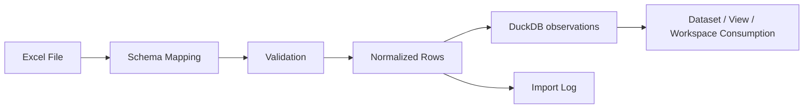

# `manual_excel` 补充数据源设计

更新日期：2026-04-26

本文档回答一个很具体的问题：

**如果 Excel 只作为补充数据源，而不是主工作台，那它在系统里到底应该怎么设计。**

---

## 1. 定位

`manual_excel` 的角色建议定义为：

**一个正式的数据源适配器，用于把人工整理的表格数据导入为标准化 dataset。**

它适合解决的问题：

- 某些指标暂时无法通过 API / MCP 直接抓取
- 有历史手工整理过的数据文件，希望纳入统一终端
- 某些专题研究需要临时补一条外部序列

它不适合承担的事情：

- 日常查看与研究主界面
- 工作区管理
- 图表配置管理
- 备注系统
- 系统中的最终真相

也就是说：

- Excel 是输入介质
- DuckDB 是运行时真相
- dataset 是研究对象

---

## 2. 设计原则

### 2.1 导入后立即脱离文件语义

一旦导入完成，后续所有操作都应该围绕系统对象进行：

- 看图时看的是 `dataset_id`
- 做比较时比的是 `dataset_id`
- 存工作区时存的是 `view_id` / `dataset_id`
- 导出时由系统重新导出，不再依赖原 Excel

### 2.2 手工数据必须可追溯

每次导入都应留下清晰记录：

- 来源文件
- sheet
- 列映射
- 导入时间
- 导入人或触发方式
- 覆盖范围
- 导入备注

### 2.3 数据和展示分离

Excel 只解决“数据怎么进来”，不解决：

- 怎么画图
- 属于哪个工作区
- 用什么默认变换
- 页面怎么布局

这些应该由：

- `dataset` 定义
- `view` 定义
- `workspace` 定义

分别负责。

---

## 3. 第一版能力边界

第一版建议支持：

- 单文件导入
- 单 sheet 或多 sheet 指定导入
- 一张表映射为一个 dataset
- 一张表内多列映射为多个 series
- 追加导入
- 覆盖导入
- 导入预检
- 导入日志

第一版可以暂时不做：

- 复杂模板识别
- 合并单元格智能推断
- 自动识别单位
- 图形化列映射器
- 大规模目录监听同步

先把“稳定、可追溯、能进库”做好，比“花哨智能”更重要。

---

## 4. 推荐的配置结构

建议把 Excel 导入配置也看成一种 source config。

示意：

```yaml
sources:
  - source_id: manual_excel.copper_tc_rc
    type: manual_excel
    file_path: 手动数据库/手动数据库.xlsx
    sheet_name: TC_RC
    dataset_id: copper.tc_rc.monthly
    date_column: 日期
    value_column: TC/RC
    unit: 美元/吨
    frequency: monthly
    timezone: Asia/Shanghai
    import_mode: upsert
    note: 铜精矿加工费手工维护表
```

如果一张表中有多列序列，可以扩展成：

```yaml
sources:
  - source_id: manual_excel.usd_liquidity_pack
    type: manual_excel
    file_path: 手动数据库/手动数据库.xlsx
    sheet_name: usd_liquidity
    dataset_id: usd.liquidity.bundle
    date_column: date
    series:
      - name: fed_balance_sheet
        value_column: walcl
        unit: billion_usd
      - name: rrp
        value_column: rrp
        unit: billion_usd
      - name: tga
        value_column: tga
        unit: billion_usd
    frequency: daily
    import_mode: upsert
```

---

## 5. 导入流程

建议导入流程固定成下面几步：



对应实现动作：

1. 读取文件和 sheet
2. 根据配置提取列
3. 统一日期格式、数值格式、空值规则
4. 生成标准 observation rows
5. 写入 DuckDB
6. 写入 import log
7. 更新 dataset freshness / metadata

---

## 6. 建议的数据校验

第一版最少建议做这些校验：

- 文件存在
- sheet 存在
- 必需列存在
- 日期列可解析
- 值列可转数值
- 主键不冲突或冲突可解释
- 时间顺序合理
- 空值比例不过高

遇到问题时，不要静默吞掉，至少应该在导入结果中给出：

- error
- warning
- skipped_rows
- duplicated_rows

---

## 7. 建议写入的元信息

除了 observations 本身，建议单独保留一张导入日志或批次表。

至少应记录：

- `import_batch_id`
- `source_id`
- `dataset_id`
- `file_path`
- `sheet_name`
- `file_mtime`
- `imported_at`
- `import_mode`
- `rows_read`
- `rows_written`
- `rows_skipped`
- `date_min`
- `date_max`
- `note`
- `status`
- `error_message`

如果以后你要复盘“这条数据为什么变了”，这张表会非常关键。

---

## 8. 与现有仓库的衔接方式

结合当前项目，`manual_excel` 最自然的落点是：

- adapter：`datahub/adapters/manual_excel.py`
- registry source config：后续放到 `config/datasets/` 或专门的 source config
- 数据写入：复用现有 DuckDB observation 表或统一写入层
- 服务消费：继续走 `app/services/`

建议职责边界如下：

- `manual_excel.py`
  只负责读表、校验、标准化、返回 rows 和 import metadata

- storage / ingest 层
  负责 upsert 到 DuckDB，并落导入日志

- registry
  负责让 dataset 知道它来自 `manual_excel`

- terminal / web
  只展示“这是手工导入数据、最后导入时间、来源说明”，不要直接和 Excel 文件耦合

---

## 9. 在终端里应该如何呈现

Excel 导入的数据进入系统后，终端里建议显示这些额外信息：

- 来源类型：`manual_excel`
- 原始来源说明
- 最后导入时间
- 最近覆盖范围
- 导入备注
- 数据质量状态

但不要把终端设计成：

- 点击某个 dataset 就跳回 Excel
- 工作区状态存在 Excel
- 图表靠 Excel 模板驱动

终端应该消费的是导入后的标准化对象，而不是原始文件。

---

## 10. 一句话结论

`manual_excel` 最好的角色不是“继续用 Excel 做研究”，而是：

**把 Excel 安全、标准、可追溯地吸进系统，然后尽快让研究工作脱离 Excel。**
